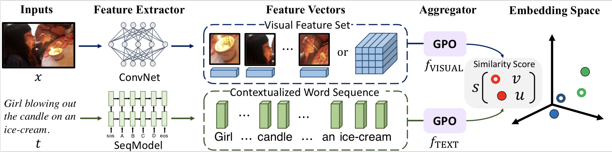

# Learning the Best Pooling Strategy for Visual Semantic Embedding

 [](https://opensource.org/licenses/MIT) 

Official PyTorch implementation of the paper [Learning the Best Pooling Strategy for Visual Semantic Embedding](https://arxiv.org/abs/2011.04305) (**CVPR 2021 Oral**).

Please use the following bib entry to cite this paper if you are using any resources from the repo.

```
@InProceedings{chen2021vseinfty,
     title={Learning the Best Pooling Strategy for Visual Semantic Embedding},
     author={Jiacheng Chen, Hexiang Hu, Hao Wu, Yuning Jiang, Changhu Wang},
     booktitle={IEEE Conference on Computer Vision and Pattern Recognition (CVPR)},
     year={2021}
} 
```


We referred to the implementations of [VSE++](https://github.com/fartashf/vsepp) and [SCAN](https://github.com/kuanghuei/SCAN) to build up our codebase. 


## Introduction



Illustration of the standard Visual Semantic Embedding (VSE) framework with the proposed pooling-based aggregator, i.e., Generalized
Pooling Operator (GPO). It is simple and effective, which automatically adapts to the appropriate pooling strategy given different data
modality and feature extractor, and improves VSE models at negligible extra computation cost.


### Image-text Matching Results

The following tables show partial results of image-to-text retrieval on COCO and Flickr30K datasets. In these experiments, we use BERT-base as the text encoder for our methods. This branch provides the code and pre-trained models for using BERT as the text backbone, please check out to the ```bigru``` branch for the code and pre-trained models for using BiGRU as the text backbone.

#### Results of 5-fold evaluation on COCO 1K Test Split

| |R1|R5|R1|R5|Link|
|---|---|---|---|---|---|
|SCAN	|72.7|94.8|58.8|88.4| - |
|VSRN (ensemble)	|76.2|94.8|62.8|89.7| - |
|VSEInfty w/ BUTD region |**79.7**|**96.4**|**64.8**|**91.4**|[Here]()|
|VSEInfty w/ BUTD grid |**80.4**|**96.8**|**66.4**|**92.1**|[Here]()|
|VSEInfty w/ WSL grid |**84.5**|**98.1**|**72.0**|**93.9**|[Here]()|

#### Results on Flickr30K Test Split

| |R1|R5|R1|R5|Link|
|---|---|---|---|---|---|
|SCAN	|67.4|90.3|48.6|77.7| - |
|VSRN (ensemble)	|71.3|90.6|54.7|81.8| - |
|VSEInfty w/ BUTD region |**81.7**|**95.4**|**61.4**|**85.9**|[Here]()|
|VSEInfty w/ BUTD grid |**81.5**|**97.1**|**63.7**|**88.3**|[Here]()| 
|VSEInfty w/ WSL grid |**88.4**|**98.3**|**74.2**|**93.7**|[Here]()|


## Preparation

### Environment

We trained and evaluated our models with the following key dependencies:

- Python 3.7.3 

- Pytorch 1.2.0

- Transformers 2.1.0


Run ```pip install -r requirements.txt ``` to install the exactly same dependencies as our experiments. However, we also verified that using the latest Pytorch 1.8.0 and Transformers 4.4.2 can also produce similar results.  

### Data

We organize all data used in the experiments in the following manner:

```
data
├── coco
│   ├── precomp  # pre-computed BUTD region features for COCO, provided by SCAN
│   │      ├── train_ids.txt
│   │      ├── train_caps.txt
│   │      ├── ......
│   │
│   ├── images   # raw coco images
│   │      ├── train2014
│   │      └── val2014
│   └── id_mapping.json  # mapping from coco-id to image's file name
│   
│
├── f30k
│   ├── precomp  # pre-computed BUTD region features for Flickr30K, provided by SCAN
│   │      ├── train_ids.txt
│   │      ├── train_caps.txt
│   │      ├── ......
│   │
│   ├── flickr30k-images   # raw coco images
│   │      ├── xxx.jpg
│   │      └── ...
│   └── id_mapping.json  # mapping from f30k index to image's file name
│   
├── weights
│      └── original_updown_backbone.pth # the BUTD CNN weights
│
└── vocab  # vocab files provided by SCAN (only used when the text backbone is BiGRU)
```

The download links for original COCO/F30K images, precomputed BUTD features, and corresponding vocabularies are from the offical repo of [SCAN](https://github.com/kuanghuei/SCAN#download-data). The ```precomp``` folders contain pre-computed BUTD region features, ```data/coco/images``` contains raw MS-COCO images, and ```data/f30k/flickr30k-images``` contains raw Flickr30K images. 

The ```id_mapping.json``` files are the mapping from image index (ie, the COCO id for COCO images) to corresponding filenames, we generated these mappings to eliminate the need of the ```pycocotools``` package. 

```weights/original_updowmn_backbone.pth``` is the pre-trained ResNet-101 weights from [Bottom-up Attention Model](https://github.com/peteanderson80/bottom-up-attention), we converted the original Caffe weights into Pytorch.

## Training

We provide example training scripts for:

1. Grid feature with BUTD CNN for the image feature, BERT-base for the text feature. See ```train_grid.sh```

2. BUTD Region feature for the image feature, BERT-base for the text feature. See ```train_region.sh```

To use other CNN initializations for the grid image feature, change the ```--backbone_source``` argument to different values: 

- (1). the default ```detector``` is to use the [BUTD ResNet-101](https://github.com/peteanderson80/bottom-up-attention), we have adapted the original Caffe weights into Pytorch and provided the download link above; 
- (2). ```wsl```  is to use the backbones from [large-scale weakly supervised learning](https://pytorch.org/hub/facebookresearch_WSL-Images_resnext/); 
- (3). ```imagenet_res152``` is to use the ResNet-152 pre-trained on ImageNet. 


## Evaluation

Run ```eval.py``` to evaluate specified models on either COCO and Flickr30K. 


